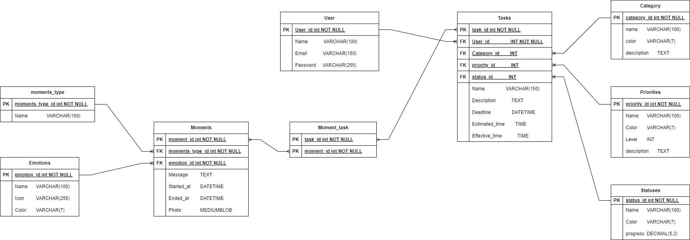

# 🌟 Focus Quest App 🌟

The **Focus Quest App** is designed to help users track their daily tasks. Unlike other task management apps, FocusQuest pays special attention to the user's emotional state during task completion. 

🔍 **Why Focus on Emotions?**  
Several psychological studies have shown that the main causes of procrastination for most people are:
1. Difficulty managing the emotions associated with a particular task.
2. Overestimating the time required to complete a task.

📚 **Source**: [Neuroscience News](https://www.neurosciencenews.com) and [IE University - Procrastination Psychology](https://www.ie.edu/center-for-health-and-well-being/blog/procrastination-psychology-effects-causes-strategies/)

## 🎯 **App Objective**  
The main goal of this app is to monitor not only the specific task but also the following factors:

1. The **emotion** the user associates with the task.
2. The **estimated time** the user believes it will take to complete the task.

By doing this, the app aims to create a virtuous cycle, where the user's emotional state is tracked during the task and a more realistic perspective of the actual time required for completion is provided.

### ⏰ **Key Features**:

- **Emotion Tracking**: Users log their emotional state before starting a task.
- **Time Estimation**: Users estimate the time they believe a task will take.
- **Progress Reflection**: Upon completing a task, the app compares the estimated time with the actual time spent and reflects on the emotional state before and after the task. This allows the user to gain insights into their emotional responses and improve their task management.

## 🗄️ **Database Structure**  

The database is structured with two main entities: **Task** and **Moment**. 

### Task Entity  
Tasks have a one-to-many relationship with the following entities: 
- **Status**
- **Priority**
- **Category**

Additionally, tasks have a one-to-many relationship with the **User** entity, tracking which user is assigned to which task.

### Moment Entity  
Moments have a one-to-many relationship with: 
- **Emotion**
- **MomentType**

Moments are also linked to the **Task** entity to track the specific task associated with each moment. All foreign keys are based on the entity’s unique **ID**.

## 🚀 Setup rapido

1. Clona il repository
2. Esegui `composer install` e `npm install`
3. Copia `.env.example` in `.env` e configura il database
4. Esegui `php artisan key:generate`
5. Esegui le migrazioni e i seeder: `php artisan migrate --seed`
6. Avvia il server: `php artisan serve`
